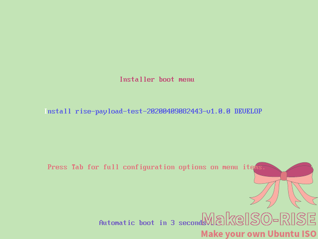

# Makeiso Rise

[](https://996.icu)

这是用于制作属于你自己的 Ubuntu ISO 的工具。

本脚本只针对于 Ubuntu-18.04.

（本项目中，包括说明在内的所有文件均派生自项目 [makeiso-kuroko](https://github.com/catscarlet/makeiso-kuroko)）

## Screenshot

### BIOS 模式



### UEFI 模式


## 依赖

- 可用的 Linux 操作系统。建议使用 Ubuntu 18.04 或 CentOS 7.5.1804 或更新版本，因为其默认包含 rsync 3.1.2
- ubuntu-18.04.4-server-amd64.iso 光盘镜像
- genisoimage
- rsync 3.1.1+

## 使用方式

推荐顺序：

1. 修改全局变量
2. 将需要安装的额外文件放入 `PAYLOAD_PATH`，并编写一个 install.sh 用于在目的机上安装。**请注意不要包含任何交互性操作**。
3. 执行 makeiso.sh 生成 iso 文件（需要超级用户权限，因为要 mount iso）

### 全局变量

```
# INPUT
UBUNTU1804_SERVER_ISO='/tmp/mountpoint/samba/share/ubuntu-18.04.4-server-amd64.iso'
UBUNTU1804_SERVER_ISO_MOUNTPOINT='/tmp/mountpoint/ubuntu-18.04.4-server-amd64/'
PAYLOAD_PATH='./payload_sample/'
CONFIGDIR='boot.template/develop/'

# OUTPUT
NAMEPREFIX='PAYLOAD'
OUTPUTFILEDIR='./'
VERSION='v1.0.0'
TIMEZONE='UTC'

# Auto generated variables
VOLUMENAME=$NAMEPREFIX'-'`date +'%Y%m%d%H%M%S'`'-'$VERSION
VOLUMENAME_LABEL=`expr substr ${VOLUMENAME} 1 16`
FINALNAME=${VOLUMENAME}.iso
```

- **UBUNTU1804_SERVER_ISO**: 必须指定为可访问的 ubuntu-18.04.4-server-amd64.iso
- **PAYLOAD_PATH**: 为将要在系统安装完成后安装的包。在目的机系统安装并重启后，会执行一次 `bash install.sh`
- **VOLUMENAME_LABEL**: 卷标，最多支持16个字符

### 调用

```
Usage: # ./makeiso.sh -d [DEST_DIR=./] -v [RELEASE_VERSION=v1.0.0] -s [PAYLOAD_PATH=/root/payload_sample/] -7 [UBUNTU1804_SERVER_ISO=/root/iso/ubuntu-18.04.4-server-amd64.iso] -z [TIMEZONE=UTC]
```

示例 1：

`# ./makeiso.sh -7 /root/cifs/Ubuntu/ubuntu-18.04.4-server-amd64.iso`

示例 2：

`# ./makeiso.sh -d /root/ -v test20200331 -s ./payload_sample/ -7 /root/cifs/Ubuntu/ubuntu-18.04.4-server-amd64.iso -z 'Asia/Shanghai'`

之后你就会得到一个 ISO 文件。默认 root 密码为 'makeiso-rise' 。


**在 kickstart-post 中不包含任何关于安装位置的配置。安装时仍需手动选择安装位置**


* * *


## 开发建议

对于不涉及 Ubuntu 安装光盘的操作，建议都放置于 PAYLOAD 目录下，由 install.sh 调用；

本项目目的在于帮助对于不熟悉 Ubuntu 打 ISO 安装光盘的开发者学习和快速实现。您应该根据自己的项目需要，编写自己的 Kickstart 文件（payload-develop.cfg）。

## 其他

### 项目名 Rise

CentOS 7.5.1804 ， Ubuntu 18.04 和 ALICE OR ALICE 动画，均在 2018.04 发布。

### 目录名 Payload

参见另一个仓库的 ["Idea about naming the directory Payload"](https://github.com/catscarlet/makeiso-kuroko/blob/master/README_zh-cmn-Hans.md#%E7%9B%AE%E5%BD%95%E5%90%8D-payload)

### Todo list

- 将输出显示到 tty，而不是仅仅保存于日志
- 使用 Systemd 替换 rc.local

## 参考资料

- [GRUB 2 Custom Splash Screen on RHEL 7 UEFI and Legacy ISO Image](http://www.tuxfixer.com/set-grub2-custom-splash-screen-on-rhel-7-centos-7-uefi-and-legacy-bios-iso-image/)
- [Grub2/Displays](https://help.ubuntu.com/community/Grub2/Displays#Troubleshooting_Splash_Images)
- [Automating the installation using preseeding](https://help.ubuntu.com/lts/installation-guide/s390x/apb.html)

## Contribution

任何贡献都是受欢迎的. 请向 分支**dev** 发起 Pull request 。

## License

Makeiso-Rise 使用基于 MIT License 构建的 反996许可证版本1.0

默认背景图片是我自己画的，暂无 License.

如果您出于 **商业目的** 使用本项目，您应该 **移除** 或 **替换** 默认背景图片。
